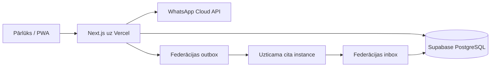

# Kopienas pieprasījumu sistēma — arhitektūra

## Mērķis

Pašhostējama, mobile-first sistēma slēgtām uzņēmēju kopienām. Katra instance glabā savus biedrus, autorizē viņus ar vienreizēju WhatsApp QR/deep-link ziņu un var tieši savienoties ar citām instancēm, neizmantojot centrālu datubāzi.

## Moduļi

- `auth`: vienreizēja WhatsApp QR/deep-link challenge, rate-limit un servera sesijas bez SMS vai OTP koda.
- `users`: lokālo biedru lomas un statusi.
- `requests`: pieprasījumi, redzamība, stabila grupēšana un kārtošana.
- `federation`: vienreizēji uzaicinājumi, Ed25519 paraksti, automātisks inbox/outbox worker un replay aizsardzība.
- `audit`: drošībai svarīgu darbību nemaināms žurnāls.

## Būtiskie lēmumi

1. **Modulārs monolīts.** Vienkāršāka autonomas instances izvietošana un rezerves kopijas.
2. **Supabase PostgreSQL kā vienīgā obligātā datu infrastruktūra.** Vercel Marketplace credentials nodod kā Environment Variables; darbu rinda izmanto transactional outbox tabulu un Redis nav vajadzīgs.
3. **Home instance ir autoritatīva.** Attāla instance nevar labot saņemtu ierakstu.
4. **Tiešie savienojumi.** Attālie ieraksti netiek automātiski relejoti trešajām instancēm.
5. **Invite tokens tikai savienošanai.** Pēc handshake ilgtermiņa uzticību nodrošina Ed25519 publiskās atslēgas.
6. **WhatsApp nav OAuth.** Lokālā identitāte ir admina reģistrēts E.164 numurs; WhatsApp piegādā vienreizēju kodu.

## Kārtošanas invariants

Aktīvie ieraksti tiek grupēti pēc autora. Grupas laiks ir tās redzamo aktīvo ierakstu maksimālais `updated_at`. Grupas un ieraksti grupā tiek kārtoti dilstoši, ar ID kā stabilu pēdējo salīdzinātāju.

## Federācijas protokols, MVP v1

- Uzaicinājuma secrets: 256 biti, datubāzē tikai HMAC digest, derīgs vienu reizi.
- Handshake apmaina `instance_id`, canonical URL, protokola versiju un Ed25519 publisko atslēgu.
- Event pieprasījuma paraksta payload ietver metodi, path, timestamp, nonce un body SHA-256.
- Saņēmējs pārbauda 5 minūšu laika logu, nonce unikumu, peer statusu un parakstu.
- `event_id` un `(origin_instance_id, origin_request_id)` nodrošina idempotenci.
- Protokols nepieļauj transitīvu releju.

## Atliktais pēc MVP

- obligāts WebAuthn adminiem;
- admina manuāls dead-letter retry interfeiss;
- failu pielikumi;
- WhatsApp paziņojumi, kas nav autentifikācija;
- pilna instances atslēgu rotācijas ceremonija.
