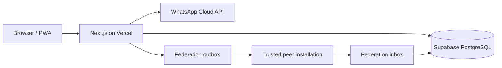

# Specific Requests architecture

## Purpose

A self-hosted, mobile-first system for private business communities. Each installation owns its members, authenticates them through a one-time WhatsApp QR/deep-link message, and can connect directly to other independent installations without a central database.

## Modules

- `auth`: one-time WhatsApp QR/deep-link challenge, rate limits, and server sessions without SMS or an OTP entry form.
- `users`: local member roles, status, encrypted phone data, and HMAC lookup identifiers.
- `requests`: request ownership, visibility, stable grouping, filtering, and ordering.
- `federation`: one-time invitations, endpoint validation, Ed25519 signatures, inbox/outbox delivery, idempotency, and replay protection.
- `audit`: append-only evidence for security-relevant actions.

## Architectural decisions

1. **Modular monolith.** One deployable application keeps independent installation and backup straightforward.
2. **Supabase PostgreSQL is the only required data infrastructure.** Vercel Marketplace provides credentials through environment variables. A transactional outbox avoids a mandatory Redis service.
3. **The home installation is authoritative.** A receiving installation cannot edit a remote request.
4. **Connections are direct.** An installation never forwards received remote records to a third installation.
5. **Pairing codes only bootstrap trust.** Long-term requests are authenticated with the peer's Ed25519 public key.
6. **WhatsApp is not OAuth.** Local identity is an administrator-registered E.164 number; the webhook proves the sender of a short-lived, one-time message.

## Ordering invariant

Active records are grouped by their stable author identity. A group's activity time is the maximum `updated_at` of its visible active records. Groups and records inside each group are sorted newest first, with an ID as the stable final comparator.

Protocol v1 peers may omit the stable `author.id`; the receiver then falls back to the legacy installation-id plus display-name grouping key.

## Federation protocol v1

- Invitation secrets contain 256 random bits, are stored only as an HMAC digest, expire, and can be accepted once.
- A handshake exchanges `instance_id`, canonical URL, protocol version, and Ed25519 public key.
- Pairing and peer URLs require an exact endpoint, HTTPS in production, no redirects, and DNS/resolved-IP validation against local, private, link-local, reserved, documentation, and multicast networks.
- The signed request payload contains method, path, timestamp, nonce, and body SHA-256.
- The receiver validates a five-minute timestamp window, unique nonce, active peer, signature, and equality between the peer identity and event `originInstanceId`.
- `event_id` and `(origin_instance_id, origin_request_id)` make delivery idempotent.
- Only a request created by the sending home installation can be placed in its outbox, preventing transitive relay.

## Deferred work

- mandatory WebAuthn for Owner/Admin accounts;
- administrator dead-letter retry controls;
- file attachments;
- WhatsApp notifications unrelated to authentication;
- a complete installation key-rotation ceremony;
- cursor-based API pagination for installations beyond the current list-size target.
