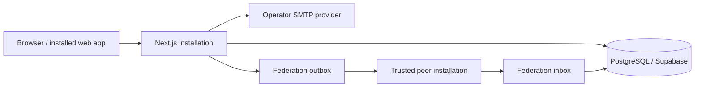

# Specific Requests architecture

## Purpose

Specific Requests is a self-hosted, mobile-first system for private business communities. Each installation owns its members, PostgreSQL database, email provider account and federation identity. Installations communicate directly without a central application database or shared authentication service.

## Runtime topology

Supabase is used as managed PostgreSQL infrastructure. Member authentication is implemented by this application and SMTP; it does not use Supabase Auth.

## Application modules

- `setup`: database readiness, installation secret verification, SMTP delivery test, owner creation and per-installation Ed25519 key generation.
- `auth`: email magic-link challenges, enumeration-resistant responses, rate limits, digest-only tokens, revocable server sessions and the development-only local administrator flow.
- `users`: local roles, status, profile data, optional website, encrypted phone data and HMAC lookup identifiers.
- `requests`: ownership, author-selected sharing visibility, stable grouping, filtering, editing, deletion and newest-first ordering.
- `contacts`: validated email, E.164 phone, WhatsApp deep links and normalized HTTP(S) website links for members of the same installation.
- `federation`: one-time pairing codes, endpoint validation, Ed25519 signatures, inbox/outbox delivery, idempotency and replay protection.
- `email`: Brevo, Mailjet or custom SMTP settings encrypted in the installation database, with optional environment fallback.
- `legal`: operator-controlled legal entity, privacy contact, retention and cookie information.
- `audit`: append-only evidence for security-relevant actions.

## Authentication flow

1. A user enters the administrator-registered email on `/`.
2. The public response is identical for registered and unknown addresses.
3. A registered active user receives a link containing a 256-bit token in the URL fragment.
4. Client code sends the token to the same-origin confirmation endpoint.
5. The server verifies the HMAC digest, expiry, single-use state and active user.
6. The server creates a 30-day revocable session and stores only its digest.
7. The browser receives the raw session token in an HttpOnly, SameSite cookie.

Magic links expire after 10 minutes. Request limits are enforced per IP address and per normalized email digest.

Every role uses this flow. Owners and administrators receive additional navigation entries after authentication; there is no separate administrator login.

## Secret derivation and encrypted data

The installation derives independent cryptographic material for sessions, phone lookup and data encryption from an installation-local root secret. Explicit overrides are supported for controlled key management.

- phone values, SMTP credentials and the federation private key use AES-GCM encryption;
- phone lookup uses a keyed HMAC identifier;
- pairing, email challenge and session secrets are stored only as digests;
- raw secrets are never returned by administration APIs.

Key rotation requires a documented migration because ciphertext remains tied to the previous encryption key.

## Database and deployment

The application uses Drizzle with append-only PostgreSQL migrations.

Vercel runs `pnpm vercel-build`:

1. if a supported database URL is present, apply migrations;
2. if no database URL is present, skip migrations with a clear warning;
3. build the Next.js application in both cases.

This allows the initial deployment to expose installation help before Supabase is connected. A production release is complete only after the database-backed deployment and `/api/health` check succeed.

## Ordering invariant

Active records are grouped by stable author identity. A group activity time is the maximum `updated_at` of its visible active records. Groups and records inside each group are sorted newest first, with the record ID as the stable final comparator.

Protocol v1 peers may omit a stable `author.id`; the receiver then falls back to the legacy installation-ID plus display-name grouping key.

## Federation trust model

- Each accepted pairing code grants one receiving direction.
- The opposite direction requires a separate code issued by the other installation.
- Invitation secrets contain 256 random bits, are stored only as an HMAC digest, expire after 24 hours and can be accepted once.
- A handshake exchanges `instance_id`, canonical URL, protocol version and Ed25519 public key.
- Peer URLs require an exact endpoint, production HTTPS, no redirects and DNS/resolved-IP rejection of local, private, link-local, reserved, documentation and multicast networks.
- Signed requests bind method, path, timestamp, nonce and body SHA-256.
- The receiver validates a five-minute timestamp window, unique nonce, active peer, signature and equality between the signing peer and `originInstanceId`.
- `event_id` and `(origin_instance_id, origin_request_id)` make delivery idempotent.
- Only a request created by the sending home installation can enter its outbox, preventing transitive relay.

Contact details are not included in federation events. A remote request identifies its author and home installation, but email, phone and website actions remain local to the originating installation.

## Privacy boundaries

- The installation operator is responsible for its member list, legal basis, processor agreements, retention and access decisions.
- A request leaves its home installation only when its author selects a sharing scope.
- Remote requests are read-only at the receiving installation.
- Deleting a user removes direct profile data while historical requests remain anonymized where required by the product contract.
- Cookie preferences are stored locally in the browser; the persistent settings control allows the visitor to reopen the notice.

## Deferred work

- optional WebAuthn as a second factor for Owner/Admin accounts;
- administrator dead-letter retry controls;
- file attachments;
- optional contact notifications unrelated to authentication;
- a complete installation key-rotation ceremony;
- cursor-based server pagination for installations beyond the current list-size target;
- automated browser end-to-end coverage for authentication, administration and federation.
